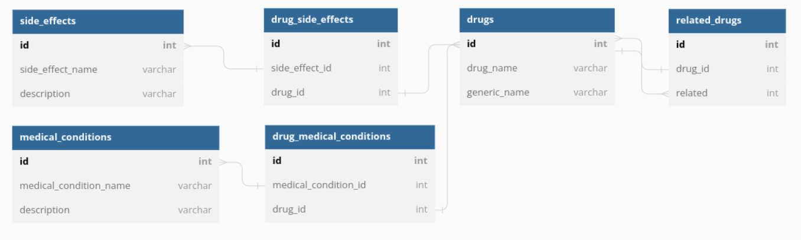

# Mining Drugs!

## Summary:  
This repository is a data mining project at ```<ITC>```

The website of choice is: https://www.drugs.com/  
For more information on the website go to: https://www.drugs.com/support/about.html

This program scrapes drug data from the site for the following attributes: 
- drug name
- drug generic name
- medical conditions (prescription reason)
- side effects
- related drugs

The data is retrived from the html, proccesed and stored in a mysql database with the following schema:
## DataBase:


## Contributors:  
Omri Abo [LinkedIn](https://www.linkedin.com/in/omri-abo-563368184/)  
Ben Sivan [LinkedIn](https://www.linkedin.com/in/ben-sivan-3733bb105/)  


Run ```python scrape_drugs.py``` to retrive data from the site
